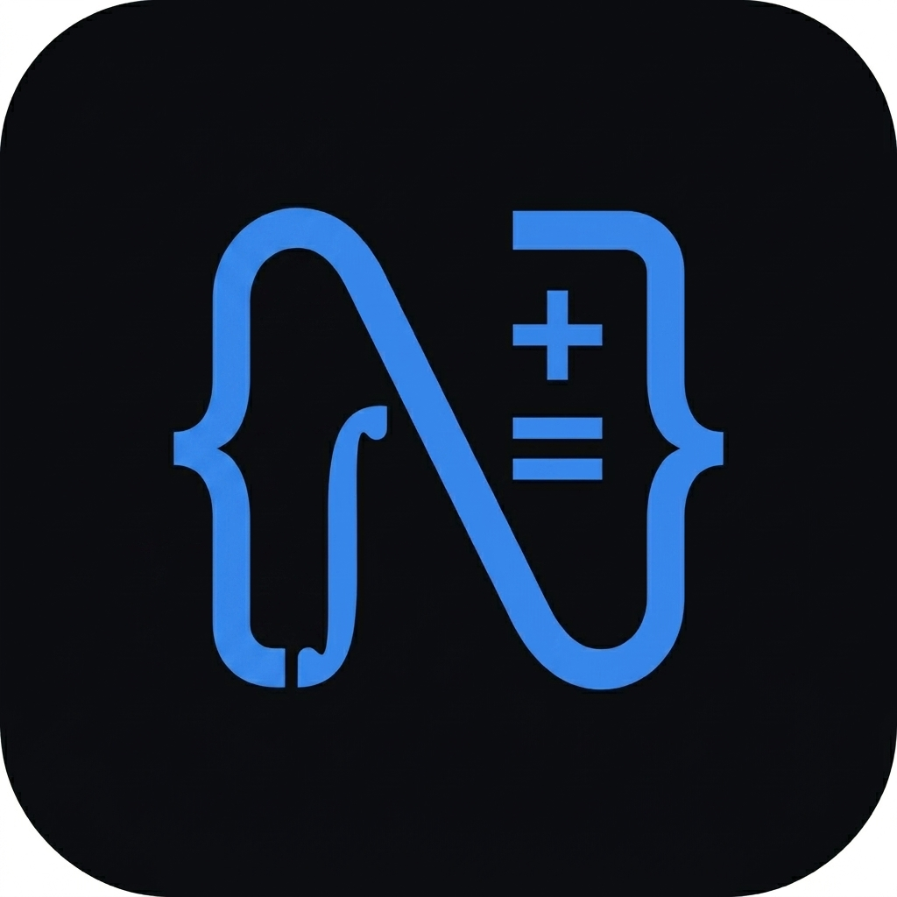
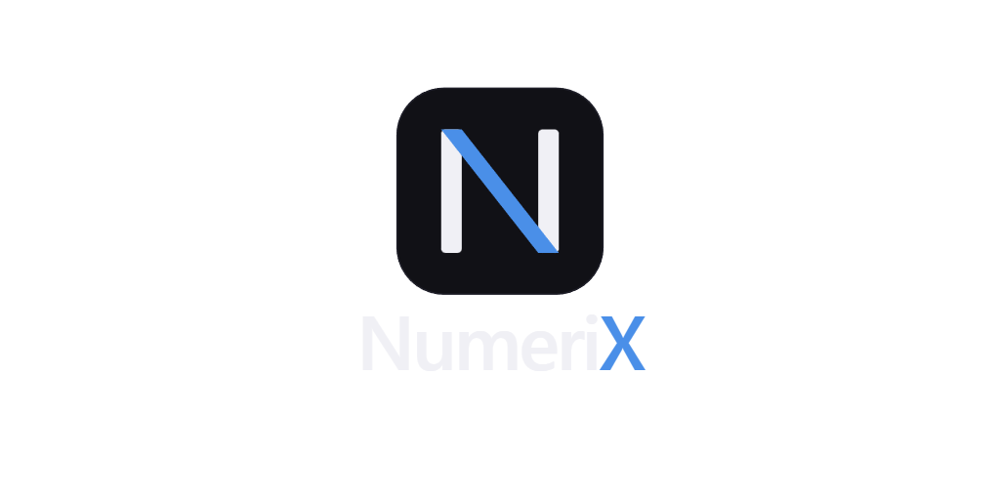

#  NumeriX - Numerical Methods Calculator



**NumeriX** is a high-end, professionally designed Flutter application for solving complex numerical methods. It features a sleek "Control Panel" aesthetic with smooth animations, high-precision calculations, and a user-friendly interface.

---

## 🚀 Key Features

### 🔍 Root Finding
Find where $f(x) = 0$ using iterative bracketing and tangent methods.
- **Bisection Method**: Reliable interval halving technique.
- **False Position**: Linear interpolation between bracket points.
- **Newton-Raphson**: Fast tangent-based iteration (requires derivative).
- **Secant Method**: Efficient two-point derivative approximation.

### 📐 Linear Systems
Solve systems of linear equations using direct and efficient algorithms.
- **Doolittle LU Decomposition**: Effective for solving multiple right-hand sides.
- **Thomas Algorithm**: Extremely fast $O(n)$ solver for tridiagonal systems.

### 🔄 Iterative Solutions
Approximate solutions through successive iteration until convergence.
- **Jacobi Iteration**: Reliable simultaneous update method.
- **Gauss-Seidel**: Fast sequential update method for dominant matrices.

### 📈 Interpolation
Estimate values between known data points using various polynomial techniques.
- **Newton Forward/Backward**: Using difference tables for equal spacing.
- **Stirling's Formula**: Central difference method.
- **Lagrange Polynomials**: Handles unequal spacing with ease.

---

## ✨ Design Aesthetics
- **Modern UI**: Dark mode glassmorphism with vibrant blue accents.
- **Fluid Animations**: Staggered entrance animations and smooth transitions.
- **Precision Control**: Customizable decimal precision for all calculations.
- **Responsive Layout**: Optimized for both mobile and tablet devices.

---

## 🛠️ Built With

* [Flutter](https://flutter.dev/) - The framework for building beautiful, natively compiled applications.
* [Riverpod](https://riverpod.dev/) - Reactive state management.
* [Math Expressions](https://pub.dev/packages/math_expressions) - Parsing and evaluating mathematical functions.
* [Google Fonts](https://fonts.google.com/) - Premium typography (Inter).

---

## ⚙️ Installation & Running

To run NumeriX locally, ensure you have the [Flutter SDK](https://docs.flutter.dev/get-started/install) installed.

1. **Clone the repository:**
   ```bash
   git clone https://github.com/abouryi12/Numerical-Methods-Calculator.git
   ```

2. **Navigate to the project directory:**
   ```bash
   cd Numerical-Methods-Calculator
   ```

3. **Install dependencies:**
   ```bash
   flutter pub get
   ```

4. **Run the app:**
   ```bash
   flutter run
   ```

---

## 👤 Author
**abouryi12**

---

## 📄 License
This project is for educational purposes. Feel free to explore and learn!
